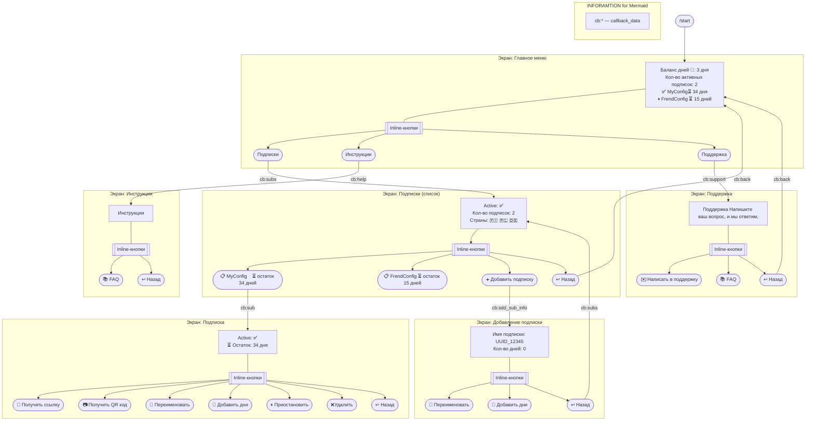

## Bot menu

```mermaid
flowchart TB
%% ========== INFORAMTION ==========
subgraph INFORAMTION["INFORAMTION for Mermaid"]
   legend["cb:* — callback_data"]
end

%% ========== ТОЧКА СТАРТА ==========
  start([/start]) --> main_info

%% ========== ГЛАВНОЕ МЕНЮ ==========
  subgraph MAIN["Экран: Главное меню"]
    direction TB

    main_info["Баланс дней 📅: 3 дня<br>Кол-во активных подписок: 2<br>✅ MyConfig⏳ 34 дня<br>⏸ FrendConfig ⏳ 15 дней"]
    main_kb[[Inline-кнопки]]

    main_btn_subs(["Подписки"])
    main_btn_help(["Инструкции"])
    main_btn_support(["Поддержка"])

    main_info --- main_kb
    main_kb --> main_btn_subs
    main_kb --> main_btn_help
    main_kb --> main_btn_support
  end

  %% ========== ПОДПИСКИ (СПИСОК) ==========
  subgraph SUBS["Экран: Подписки (список)"]

    subs_info["Active: ✅<br>Кол-во подписок: 2<br>Страны: 🇫🇮 🇵🇱 🇩🇪"]

    subs_kb[[Inline-кнопки]]

    btn_my(["📋 MyConfig    ⏳ остаток 34 дней"])
    btn_fr(["📋 FrendConfig ⏳ остаток 15 дней"])
    btn_add_sub(["➕ Добавить подписку"])
    btn_back(["↩ Назад"])

    subs_info --> subs_kb
    subs_kb --> btn_my
    subs_kb --> btn_fr
    subs_kb --> btn_add_sub
    subs_kb --> btn_back
    
  end

  %% ========== 1 ПОДПИСКА ==========
    %% На примере 1 подписки MyConfig
  subgraph  SUB["Экран: Подписка"]
    direction TB
    sub_info["Active: ✅<br>⏳ Остаток: 34 дня"]
    sub_info --- sub_kb
    sub_kb[[Inline-кнопки]]
    sub_btn_get_link(["🔗 Получить ссылку"])
    sub_btn_get_qr(["📷 Получить QR код"])
    sub_btn_rename(["📝 Переименовать "])
    sub_btn_add_day(["📅 Добавить дни"])
    sub_btn_pause(["⏸ Приостановить"])
    sub_btn_delete(["❌Удалить"])
    sub_btn_back(["↩ Назад"])
    
    sub_kb --> sub_btn_get_link
    sub_kb --> sub_btn_get_qr
    sub_kb --> sub_btn_rename
    sub_kb --> sub_btn_add_day
    sub_kb --> sub_btn_pause
    sub_kb --> sub_btn_delete
    sub_kb --> sub_btn_back
  end

%% Добавление подписки
subgraph ADD_SUB["Экран: Добавление подписки"]
direction TB
    add_sub_info["Имя подписки: UUID_12345<br>Кол-во дней: 0"]
    add_sub_kb[[Inline-кнопки]]
    add_sub_btn_rename(["📝 Переименовать "])
    add_sub_btn_add_day(["📅 Добавить дни"])
    add_sub_btn_back(["↩ Назад"])

    add_sub_info --- add_sub_kb
    add_sub_kb --> add_sub_btn_rename
    add_sub_kb --> add_sub_btn_add_day
    add_sub_kb --> add_sub_btn_back
end


%% ========== ПОДДЕРЖКА ==========
subgraph SUPPORT["Экран: Поддержка"]
  direction TB
  support_info["Поддержка Напишите ваш вопрос, и мы ответим."]

  support_kb[[Inline-кнопки]]
  support_btn_chat(["✉️ Написать в поддержку"])
  support_btn_faq(["📚 FAQ"])
  support_btn_back(["↩ Назад"])

  support_info --- support_kb
  support_kb --> support_btn_chat
  support_kb --> support_btn_faq
  support_kb --> support_btn_back
end

subgraph INSTRUCTION["Экран: Инструкции"]
  help_kb[[Inline-кнопки]]
  help_info["Инструкции"]
  help_btn_faq(["📚 FAQ"])
  help_back_menu(["↩ Назад"])
  help_info --- help_kb

  help_kb --> help_btn_faq
  help_kb --> help_back_menu
end

%% ========== ПЕРЕХОДЫ ПО CALLBACK ==========
  main_btn_subs -->|cb:subs| subs_info
  btn_my -->|cb:sub| sub_info
  main_btn_help -->|cb:help| help_info
  main_btn_support -->|cb:support| support_info
  btn_add_sub -->|cb:sdd_sub_info| add_sub_info


  btn_back -->|cb:back| main_info
  add_sub_btn_back --> |cb:subs|subs_info
  support_btn_back -->|cb:back| main_info


```
